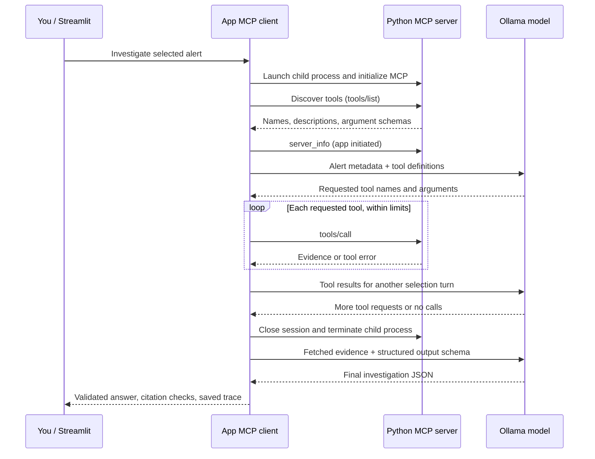

# Understanding MCP in AI SOC Lab

## The mental model

The SOC app is both an Ollama client and an MCP client. Ollama selects tools; the app executes them through a separate Python MCP server. The server provides synthetic evidence. It does not call the model or perform the final investigation.

“Server” describes a role: serving requests. Here it is a child process on your laptop, not a web server or VM. Stdio pipes carry MCP messages between the processes. The SDK handles message serialization and protocol details. Server diagnostic logs go to stderr; stdout must remain reserved for MCP.



This is a conceptual sequence. A model may request several tools in one turn, request fewer than expected, or make invalid calls. The application runs those calls sequentially.

## Start with the no-model demo

1. Open **MCP lab** and click **Discover tools and fetch sample evidence (no model)**.
2. Find **Launch server**: the command is the environment's Python executable followed by `-m soc.mcp_server`.
3. Compare the client PID with the PID returned by `server_info`. They identify different processes.
4. Inspect **MCP initialize**: the client and server negotiate the protocol and capabilities.
5. Inspect **MCP tools/list**: each tool has a name, description, and input schema.
6. Inspect the four **MCP tools/call** entries. This demo deliberately calls `server_info`, `get_alert`, `get_user`, and `query_login_events`; no model chooses them.
7. Find the close-session entry. The server is started per connection, rather than kept running indefinitely.

**Checkpoint:** Explain why discovering a tool is different from executing it, and why this demo works without an LLM.

## Then inspect a model-driven run

Enable **Gather evidence through MCP**, select a scenario, and investigate it. Open the saved run in **Learning inspector** or **Model monitoring**.

- **Initial model input:** alert ID, alert description, and affected user ID. The full fixture timeline visible in the UI is not automatically sent.
- **Tool definitions:** discovered MCP schemas are converted into Ollama function definitions. The protocols are separate; the app connects them.
- **Model tool selection:** inspect the exact request and returned `tool_calls`. These are requests for the app to execute, not evidence that execution happened.
- **MCP tools/call:** inspect arguments, `source`, result content, `isError`, and latency. `server_info` is app initiated; investigation calls are model requested.
- **Tool feedback:** the app appends successful results or errors as `role: tool` messages before another model-selection turn.
- **Final generation:** the app makes a separate structured-output request using successfully collected evidence. It does not trust intermediate model prose as factual evidence.
- **Validation:** Pydantic checks output structure; citation checks verify event IDs exist. Neither establishes that a claim is factually supported.

The model need not call all three investigation tools: it already has alert metadata. A useful run normally fetches the profile and event timeline. Tool order can vary.

**Checkpoint:** Distinguish a model-requested call, an executed MCP call, and a successful result. Find an example of each in the trace.

## Code reading order

| File / functions | What to look for |
|---|---|
| [soc/data.py](soc/data.py) | Synthetic alerts, users, events, and stable event IDs |
| [soc/mcp_server.py](soc/mcp_server.py) | `FastMCP`, `@mcp.tool()`, Python argument annotations/docstrings, lookup functions, and `mcp.run(transport="stdio")` |
| [soc/mcp_client.py](soc/mcp_client.py): `connect` | Python executable selection, child-process launch, initialization, discovery, and resource cleanup |
| Same file: `call` | Actual `session.call_tool`, result/error handling, JSON decoding, and trace recording |
| Same file: `demo_async` and `demo` | A deterministic MCP interaction independent of model quality |
| Same file: `gather` | MCP-to-Ollama schema conversion, selection loop, allowed-tool checks, alert scope checks, tool messages, and evidence accumulation |
| Same file: `gather_evidence` | Synchronous entry point into the async workflow and overall timeout |
| [soc/core.py](soc/core.py): `investigate` | Alert-only input, evidence gathering, final structured generation, validation, and persistence |
| [soc/inspector.py](soc/inspector.py): `show_run` | How saved execution steps become the learning view |
| [app.py](app.py) | MCP mode toggle, no-model demo button, and links between chat and saved runs |
| [tests/test_mcp.py](tests/test_mcp.py) | Real subprocess tests for discovery, evidence, and protocol tool errors |

## Async: already present in this implementation

The “async wrapper” seen at work could mean several things. Our code gives you concrete patterns to compare, without assuming it is the same wrapper.

- `async def` defines a coroutine. Calling it creates an awaitable; it does not immediately run the whole function.
- `await` waits cooperatively for an operation such as receiving a tool result or an HTTP response. The event loop can run other ready tasks while waiting.
- `async with` manages asynchronous setup and cleanup. In `connect`, nested contexts manage pipes and the MCP session.
- `@asynccontextmanager` turns `connect` into an async context manager. It yields the live session to the caller and resumes afterward for cleanup.
- `asyncio.run` bridges the synchronous Streamlit code to the asynchronous MCP workflow by creating and closing an event loop.
- `asyncio.wait_for` imposes a deadline and cancels the awaited operation when it expires.
- `httpx.AsyncClient` lets model-selection HTTP calls participate in that async workflow. Final generation currently uses synchronous `httpx.Client`.

Async is not synonymous with threads, processes, or parallel execution. Our tool calls run sequentially. The MCP SDK can manage concurrent protocol work, but adding `async` alone does not make independent tools run simultaneously. The UI still waits for this synchronous bridge to return; this implementation does not stream progress live.

**Checkpoint:** Trace `app.py → investigate → gather_evidence → asyncio.run → gather → connect/call`. Explain where execution waits and which function owns cleanup. `asyncio.run` belongs at a synchronous boundary; an application already running an event loop should await the coroutine instead.

## Short learning plan

1. **Protocol without AI:** run the demo, identify both processes, and explain initialize/list/call/close.
2. **Model vs application responsibilities:** inspect one model-selected run and match requested calls to actual results.
3. **Failure handling:** read the unknown-user test, run the tests, and inspect `isError`. Review rejected tools and missing-evidence warnings in the code.
4. **Async lifecycle:** follow the call chain above and explain cancellation, timeouts, and context cleanup.
5. **Small extension:** add a read-only tool such as `get_device`, verify it appears in discovery, then inspect whether the model uses it. Update alert scoping and evidence collection deliberately rather than assuming discovery is sufficient.
6. **Hosting later:** compare this stdio lifecycle with an independently running Streamable HTTP server or container when we reach deployment.

Run the existing checks:

```sh
source .venv/bin/activate
python -m unittest discover -s tests -v
```

## Limits to keep in mind

- Four model-selection turns, six model-requested tool calls, a 15-second MCP request timeout, and a 240-second gathering deadline bound execution. The final generation has a separate timeout.
- Model-selected calls are restricted to the selected alert/user. This is a local demo guard, not production authorization.
- MCP-mode questions are investigated afresh without previous conversation history.
- No hidden fallback supplies the original timeline if tool gathering fails. A no-events warning means the evidence gathering was incomplete.
- Main token metrics describe final generation only. Intermediate model usage is recorded in the trace; end-to-end latency includes all stages.
- Trace entries summarize SDK operations and payloads; they are not a capture of every raw protocol frame. A close entry records leaving the session body, while the surrounding SDK context performs actual teardown.

## References

- [Official MCP Python SDK v1 documentation](https://py.sdk.modelcontextprotocol.io/v1/) — the pinned SDK API used here.
- [Ollama tool calling](https://github.com/ollama/ollama/blob/main/docs/capabilities/tool-calling.mdx) — model tool requests and result messages.
- [Python asyncio](https://docs.python.org/3/library/asyncio.html) — coroutines, event loops, and timeouts.


## Comparing reference evidence with retrieved evidence

The investigation panel is now **Scenario reference evidence**. It shows the fixture for your understanding. Direct mode receives this fixture; MCP mode begins with only alert ID, description, and user ID. `get_user` and `query_login_events` retrieve the same reference data through actual MCP calls. That demonstrates the process boundary, rather than introducing new facts.

The separate [soc/device_data.py](soc/device_data.py) source adds facts that are not in those fixtures. `get_device_history(user_id)` exposes it only through MCP. Records have stable IDs such as `device-u101-1`, which findings can cite alongside event IDs. The benign scenario has a familiar device, possible compromise has an unfamiliar device, failed attack has a known device with no attribution to the failed attempts, and insufficient evidence has limited retention and missing device identity. These are synthetic observations, not definitive verdicts.

Use this comparison sequence:

1. Select MCP mode and run an investigation. Look immediately below its answer for **MCP evidence summary**.
2. Compare **Initial alert-only request before MCP gathering** in Learning inspector with the scenario reference panel. Supporting timeline and device records are absent from initial metadata.
3. Expand **Model tool selection** in the trace to see what the model requested. Discovery and a request alone do not establish retrieval.
4. Read the successful-call table and any rejected/failed entries. It uses recorded MCP results with `isError: false`; `server_info` is kept in a separate process-inspection expander.
5. Check event count and profile status. Missing profile or timeline, errors, or execution limits produce an incomplete/review warning. Device history is optional: not requesting it does not by itself make core gathering incomplete.
6. Inspect **Collected MCP evidence**. `events` and `user` are retrieved reference data; `device_history` is the additional source. If the device tool was not successfully called, no device evidence is attributed to the run.
7. Compare the final request's evidence message with the collected records. Only fetched device history enters that request. A citation to an unfetched device ID is invalid. Retrieval alone does not prove the model used a record; inspect its claims and citations.
8. Repeat in direct mode: no device history is automatically supplied. In MCP mode you can ask “Check device history before answering,” but tool selection still belongs to the model.

Historical runs show the same summary in Model monitoring. Older runs can lack initial-request or collected-evidence fields: the summary reconstructs what it can from successful recorded results, and does not invent missing evidence. If gathering fails before final generation, recovered partial results in the summary are not evidence that a final model request occurred; inspect the error and trace.

To understand the implementation changes, review `arguments_in_scope` and `collect_result` in [soc/mcp_client.py](soc/mcp_client.py), `citation_check` in [soc/core.py](soc/core.py), and [soc/evidence_summary.py](soc/evidence_summary.py). The four-turn, six-call limits and existing timeouts are preserved.

## Read the execution graph

Below an MCP answer, **Investigation execution** provides a map of the recorded run. Repeated model-turn nodes indicate the tool-selection loop; repeated tool nodes represent separate calls, not a deduplicated list. Color labels distinguish recorded activity, successful results, warnings, failures, rejections, and unknown legacy outcomes. The graph's arrows indicate chronological execution rather than all possible workflow paths.

Expand the view and select a step to inspect its original payload. Compare a model turn's tool requests with subsequent executed calls. A call omitted because of a limit is not shown as a successful execution. Normal gathering stops are now recorded explicitly; older runs infer them from a model response without tool calls. `server_info` remains in the separate process-inspection section.

Review [soc/execution.py](soc/execution.py) for the UI-independent event projection and graph generation, and `show_execution` in [soc/inspector.py](soc/inspector.py) for rendering. Events can be projected from an incrementally growing trace, preparing for future real-time updates. The current synchronous UI displays the graph after completion; live transport, in-progress statuses, and streaming updates are not implemented yet.

The visual now covers the full application flow in both modes: submission → prompt preparation → optional MCP gathering → final Ollama request → response → schema/citation validation → saved monitoring run. Direct mode prepares reference evidence immediately; MCP mode prepares alert metadata and later assembles retrieved evidence. New runs record the generation-start boundary and persistence metadata, so a gathering failure cannot be confused with a completed final model call. Historical runs without those fields retain only the stages their records support.

The main MCP investigation panel now separates **Incoming alert** from **Retrieved investigation evidence**. Before an investigation, only alert metadata is shown prominently. Afterward, the latest run's successful results populate the panel. The full fixture is available in a collapsed **Scenario reference evidence** section for comparison; it is not a fallback for missing retrievals. This display updates after completion, not in real time yet.

## Using the staged Learning inspector

Start with one question: what evidence did the model request, and did that evidence support its answer? The Investigation tab provides a compact retrieval summary; the Learning inspector follows the recorded stages.

1. **Initial input:** the prepared payload before tool selection. MCP questions start without conversation history.
2. **Available tools and retrieval outcomes:** distinguish not requested, requested but not executed, failed/rejected, and succeeded. Profile and timeline are required by this lab’s gathering instruction; device history is optional.
3. **Model requests and actual tool results:** compare each model turn with subsequent calls. These selection requests contain the actual tool definitions sent to Ollama.
4. **Collected evidence:** inspect what retrieval produced, including MCP-only device records.
5. **Final-generation request:** verify what evidence was actually sent for the answer. If gathering failed, final generation may not have started.
6. **Answer, citations, and validation:** expand a finding to trace its citation to a record in final-generation input. A matching ID establishes presence, not factual support.

Execution overview and complete metadata are supplementary details. Context diagnostics describe final generation; they do not summarize the token usage of intermediate model turns. Use Model monitoring to compare two saved experiments, checking question, history, scenario, mode, prompt version, and settings before attributing differences to the model.
